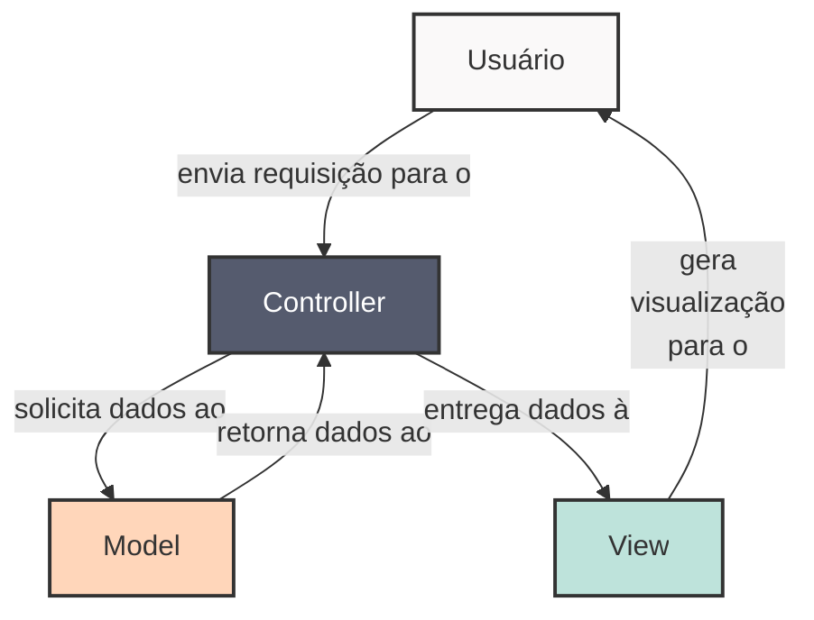
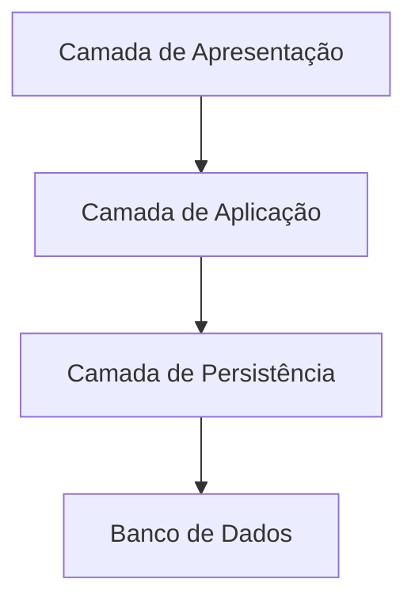
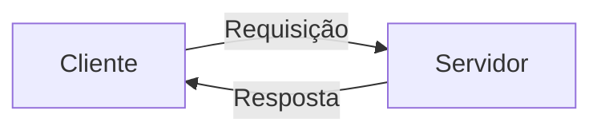
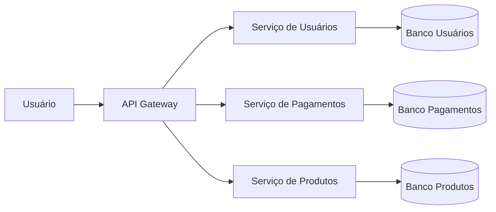
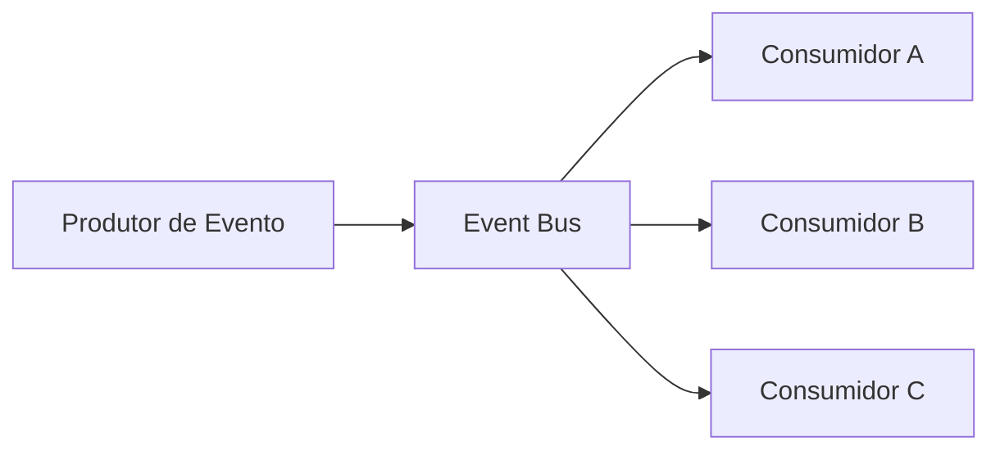
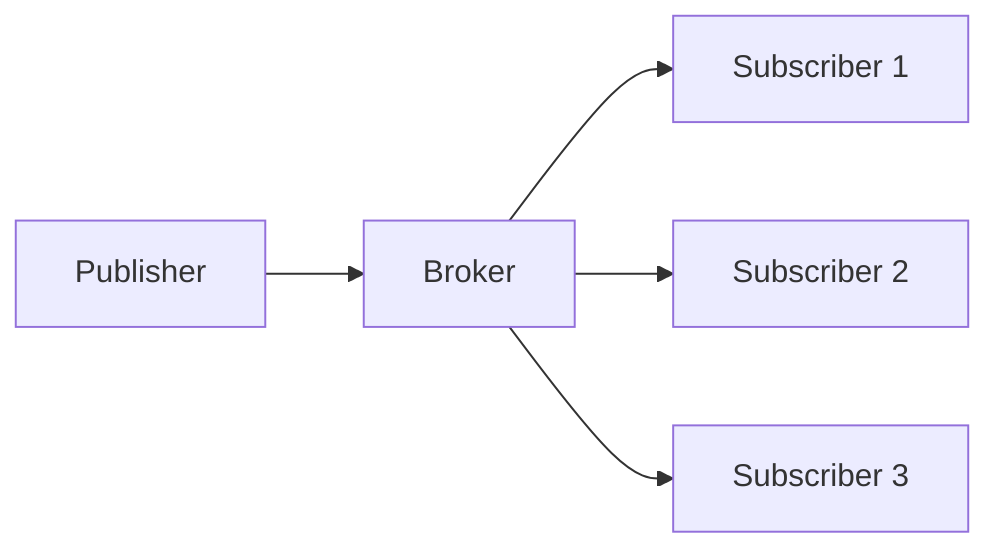

# Arquitetura de Software

A Arquitetura de Software define a estrutura fundamental de um sistema, incluindo seus componentes, as relações entre
eles e as decisões de design que orientam seu desenvolvimento e evolução.

Os **padrões arquiteturais** fornecem soluções reutilizáveis para problemas recorrentes, ajudando a organizar sistemas
de maneira escalável, flexível e compreensível.

## Model-View-Controller (MVC)

O padrão **MVC** separa a aplicação em três camadas principais:

* **Model**: gerencia os dados e regras de negócio;
* **View**: responsável pela interface e apresentação ao usuário;
* **Controller**: recebe as interações do usuário e coordena a comunicação entre *Model* e *View*.



O framework [Django](https://www.djangoproject.com) utiliza esse modelo de arquitetura. A organização de pastas em um projeto Django é semelhante 
à esta:

```
meuprojeto/
│
├── manage.py                # Script principal para rodar comandos do Django
│
├── meuprojeto/              # Pasta do projeto (mesmo nome do projeto)
│   ├── __init__.py
│   ├── settings.py          # Configurações do projeto (apps, db, etc.)
│   ├── urls.py              # Arquivo de rotas principais
│   ├── asgi.py              # Configuração para ASGI
│   └── wsgi.py              # Configuração para WSGI (deploy)
│
├── blog/                    # Um app dentro do projeto
│   ├── __init__.py
│   ├── admin.py             # Registro de modelos no Django admin
│   ├── apps.py              # Configuração do app
│   ├── models.py            # Modelos (tabelas no banco)
│   ├── tests.py             # Testes automatizados
│   ├── views.py             # Views (controladores de requisição/resposta)
│   ├── urls.py              # Rotas específicas do app
│   ├── templates/           # Templates HTML
│   │   └── blog/
│   │       └── index.html
│   └── migrations/          # Histórico de migrações do banco
│       └── __init__.py
│
├── static/                  # Arquivos estáticos (CSS, JS, imagens)
│   └── blog/
│       └── style.css
│
└── requirements.txt         # Dependências do projeto (opcional)
```

## Camadas (Layered Architecture)

A arquitetura em camadas organiza o software em níveis hierárquicos. Cada camada tem uma responsabilidade específica e
se comunica apenas com a camada imediatamente abaixo ou acima.

Exemplo clássico: **aplicações empresariais**.

* **Apresentação**
* **Aplicação (ou lógica de negócios)**
* **Persistência (ou acesso a dados)**
* **Banco de Dados**



A organização de arquivos de um projeto organizado em camadas é a seguinte:

```
empresa_app/
│
├── apresentacao/              # Interface com o usuário
│   ├── __init__.py
│   └── views.py
│
├── aplicacao/                 # Regras de negócio
│   ├── __init__.py
│   └── services.py
│
├── persistencia/              # Acesso a dados
│   ├── __init__.py
│   └── repositories.py
│
├── database/                  # Scripts ou conexão com banco
│   ├── __init__.py
│   └── schema.sql
│
└── main.py
```

## Cliente-Servidor

Nesse padrão, o sistema é dividido em dois papéis principais:

* **Cliente**: responsável por solicitar serviços (ex.: navegador Web).
* **Servidor**: responsável por fornecer serviços (ex.: servidor de páginas, banco de dados).



```
cliente_servidor/
│
├── cliente/                   # Código do cliente
│   ├── __init__.py
│   └── cliente.py
│
├── servidor/                  # Código do servidor
│   ├── __init__.py
│   └── servidor.py
│
└── main.py                    # Script principal para subir cliente/servidor
```

## Microservices

O padrão de **microsserviços** divide a aplicação em serviços independentes, cada um com uma responsabilidade bem
definida, comunicando-se geralmente por **APIs REST ou mensageiras**.

* Escalabilidade independente
* Facilidade de implantação contínua
* Resiliência (falhas isoladas)



```
microservices/
│
├── api_gateway/               # Ponto de entrada da aplicação
│   └── gateway.py
│
├── servico_usuarios/
│   ├── app.py
│   └── db_usuarios.py
│
├── servico_pagamentos/
│   ├── app.py
│   └── db_pagamentos.py
│
├── servico_produtos/
│   ├── app.py
│   └── db_produtos.py
│
└── docker-compose.yml         # Orquestração dos microsserviços
```


## Event-Driven Architecture (EDA)

Nesse padrão, componentes se comunicam através de **eventos**. Um componente **publica** eventos em um barramento e
outros componentes podem **assinar** esses eventos para reagir.

Usado em sistemas distribuídos, IoT e aplicações altamente desacopladas.



```
event_driven/
│
├── produtor/                  # Publica eventos
│   └── produtor.py
│
├── consumidores/              # Consome eventos
│   ├── consumidor_a.py
│   ├── consumidor_b.py
│   └── consumidor_c.py
│
├── event_bus/                 # Barramento de eventos (fila, Kafka, etc.)
│   └── bus.py
│
└── main.py
```

## Pipes and Filters (Tubo e Filtros)

O padrão **Pipes and Filters** organiza o processamento de dados como uma sequência de etapas (*filtros*) conectadas por
canais (*pipes*). Cada filtro recebe uma entrada, processa e envia a saída para o próximo filtro.

Exemplo: **compiladores** (análise léxica → sintática → semântica → geração de código).


```
pipes_filters/
│
├── filtros/                   # Cada filtro é um módulo independente
│   ├── filtro1.py
│   ├── filtro2.py
│   └── filtro3.py
│
├── pipes/                     # Conexões entre os filtros
│   └── pipeline.py
│
├── dados/                     # Entradas e saídas
│   ├── entrada.txt
│   └── saida.txt
│
└── main.py
```

## Publish-Subscribe

É semelhante ao **Event-Driven**, mas foca no desacoplamento entre produtores e consumidores. O **broker** gerencia a
entrega das mensagens.

* **Publisher**: emite mensagens.
* **Broker**: distribui as mensagens.
* **Subscribers**: recebem mensagens de interesse.



```
publish_subscribe/
│
├── publisher/                 # Publica mensagens
│   └── publisher.py
│
├── broker/                    # Intermediário que gerencia mensagens
│   └── broker.py
│
├── subscribers/               # Múltiplos consumidores
│   ├── subscriber1.py
│   ├── subscriber2.py
│   └── subscriber3.py
│
└── main.py
```
