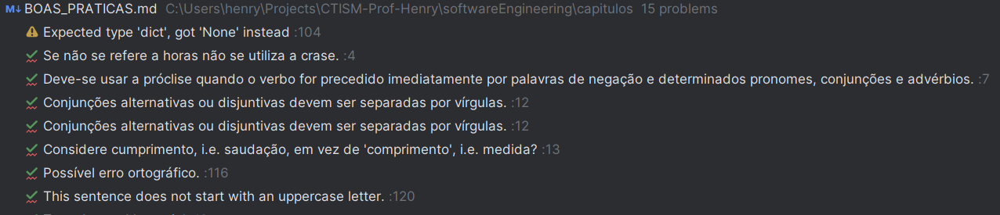

# Boas práticas

A Engenharia de Software é uma disciplina que trata sobre diversos aspectos do desenvolvimento de software, tanto
individualmente quanto em equipe. O primeiro passo para integrar-se bem à uma equipe de 
desenvolvimento é possuir uma boa base de condutas, de maneira que erros primários não sejam cometidos.

Esta página descreve boas práticas de programação a serem seguidas, tanto quando trabalha-se em equipe quanto 
individualmente.

## Evite o aninhamento prematuro de código-fonte

Códigos com muitos níveis de decisão são difíceis de ler e manter. Prefira colocar uma instrução `return` ou usar 
encapsulamento com métodos ou funções para reduzir o comprimento horizontal do código-fonte:

❌ Ruim:

```python
def processa_usuario(usuario: dict) -> bool:
   if usuario is not None:
       if usuario['ativo']:
           if usuario['idade'] > 18:
               return True
           else:
              return False
       else:
          return False
   else:
        return False
```

✅ Melhor:

```python
def processa_usuario(usuario: dict) -> bool:
    if (usuario is None) or (not usuario['ativo']):
        return False
    if usuario['idade'] <= 18:
        return False
    return True
```

## Comente o "por que", não o "como"  

Se o código precisar de muito comentário para ser entendido, ele precisa provavelmente de **refatoração**. Nome de 
variáveis e funções devem ser autoexplicativos.

❌ Ruim:

```C
/**
 * Este código copia uma string da origem (src) para o destino (dest).
 * Ele funciona da seguinte forma:
 * - Uma string em C é um bloco contíguo de caracteres `char`, terminando com um byte zero.
 * - O loop continua enquanto a condição for avaliada como diferente de zero (verdadeira).
 * - `*src` lê o caractere na posição de memória atual apontada por src.
 * - `src++` move o ponteiro src para o próximo caractere na string.
 * - A atribuição `(*dest = *src)` copia o caractere atual para o local apontado por dest.
 * - `dest++` avança o ponteiro dest para a próxima posição de memória.
 * - O loop termina quando o caractere copiado é o byte zero, indicando o fim da string.
 */
while(*dest++ = *src++);
```

✅ Melhor:

```C
/**
 * Esse código copia uma string da origem (src) para o destino (dest) 
 */
while(*src != '\0') {
    *dest = *src;
    dest++;
    src++;
}
*dest = *src;
```

## Use nomes claros e consistentes  
   
Variáveis, funções e classes devem descrever exatamente o que fazem ou representam. Nomes vagos como `data`, `temp` ou
`obj` dificultam a leitura por outras pessoas da sua equipe de desenvolvimento!

## Versione tudo e faça commits pequenos  

Cada commit deve representar **uma mudança coesa**. Commits muito grandes dificultam revisão de código e rastreamento
de bugs.

## Escreva testes automatizados desde o início  

Testes unitários e de integração ajudam a garantir que novas alterações não quebrem funcionalidades existentes,
facilitando colaboração.

Inclusive, escreva testes **antes** de escrever o código-fonte da funcionalidade!

```python
def processa_usuario(usuario: dict) -> bool:
    if (usuario is None) or (not usuario['ativo']):
        return False
    if usuario['idade'] <= 18:
        return False
    return True

def test_processa_usuario():
    assert processa_usuario(None) is False
    assert processa_usuario({}) is None
    assert processa_usuario({'nome': 'henry', 'ativo': True}) is False
    assert processa_usuario({'nome': 'henry', 'ativo': True, 'idade': 33}) is True
```

> [!NOTE]
> Você reparou que o teste acima pegou dois erros que não haviam sido previstos originalmente na implementação do 
> código-fonte? Você sabe dizer que erros são esses?

## Use linters  

Você sabia que as IDEs da Intellij (Pycharm, Intellij IDEA, Webstorm, etc) possuem linters integrados? Esses programas
detectam erros comuns de programação e sugerem correções. Ao prestar atenção em um linter, você estará escrevendo 
código-fonte mais legível e com menos possibilidade de manutenção.

Ícone do linter no Pycharm, no canto superior direito:


Mensagens do linter integrado do Pycharm:



Também é possível rodar linters ao usar outras IDEs. [pylint](https://pypi.org/project/pylint) é uma biblioteca para 
Python, mas existem bibliotecas para outras linguagens de programação também.  

## Use padronização

Padronizar espaçamento, nomeação e formatação evita discussões desnecessárias e melhora a legibilidade geral do 
código-fonte.

## Faça code reviews de forma construtiva
   
Revisões não são apenas para encontrar erros, mas para **compartilhar conhecimento** e alinhar boas práticas dentro
da equipe.

## Prefira modularidade e reuso  

Quebre funcionalidades em **componentes ou funções reutilizáveis** para facilitar manutenção e testes.

## Documente decisões técnicas  

Nem tudo vai no código. Arquivos como `README.md` ou wikis internas ajudam novos membros a entenderem **o contexto**
e **as escolhas do projeto**.

## Tenha cuidado com dependências externas

Escolha bibliotecas bem mantidas, com licenças adequadas, e evite acoplamento excessivo que dificulte futuras 
atualizações.
