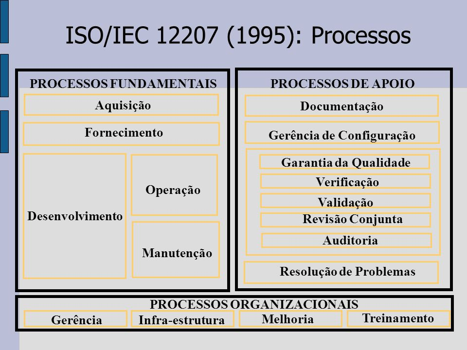

# Ciclo de vida do software

O ciclo de Vida do Software é definido formalmente pela [ISO 12207](https://www.iso.org/standard/63712.html), proposta
inicialmente em 1995, com termos técnicos e descrições específicas das diferentes etapas que um software passa durante
seu desenvolvimento e implementação, bem como atividades correlatas.

É importante salientar que esta norma não define um modelo de processo de software (cascata, incremental, ágil) a ser
seguido, mas tão somente define os processos envolvidos no desenvolvimento de software. Elas são organizadas em três
grandes grupos, cada um com seus processos. Estes processos também **não são todos** obrigatórios, e devem ser
aplicados conforme o contexto do software sendo desenvolvido.

## Processos fundamentais

São diretamente ligados à entrega do software:

* **Aquisição:** O cliente especifica e contrata software.
* **Fornecimento:** O fornecedor entrega o produto contratado.
* **Desenvolvimento:** Especificação, projeto, codificação e testes.
* **Operação:** Uso e suporte operacional do software.
* **Manutenção:** Correções, adaptações e melhorias pós-entrega.

## Processos de apoio

Dão suporte e garantem qualidade:

* **Documentação:** Produzir e manter documentos necessários para todo o ciclo de vida (manuais, relatórios, guias,
  registros).
* **Gerência de Configuração:** Controlar e rastrear versões, mudanças e itens de configuração do software.
* **Garantia da Qualidade:** Monitorar e avaliar se os processos e produtos estão de acordo com padrões e requisitos
  definidos.
* **Verificação:** Conferir se cada produto ou componente atende às especificações técnicas estabelecidas.
* **Validação:** Garantir que o produto final realmente atenda às necessidades e expectativas do usuário.
* **Revisões Conjuntas:** Reuniões entre partes interessadas para avaliar o andamento e resultados de um projeto.
* **Auditorias:** Avaliar formalmente a conformidade com processos, padrões, contratos e regulamentos.
* **Resolução de Problemas:** Detectar, registrar, analisar e corrigir problemas que surgem durante o ciclo de vida.

## Processos organizacionais

Visam à melhoria contínua e gestão global:

* **Gerência de Projetos:** Planejar, monitorar e controlar o projeto para cumprir prazos, orçamento e requisitos.
* **Infraestrutura:** Prover recursos físicos, tecnológicos e administrativos necessários ao desenvolvimento e
  manutenção.
* **Melhoria do Processo:** Avaliar e aperfeiçoar continuamente os processos usados na organização.
* **Treinamento:** Planejar e executar ações para capacitar a equipe em processos, ferramentas e tecnologias.
* **Gestão de Portfólio e Ativos Reutilizáveis:** Organizar e gerenciar componentes de software e conhecimento que podem
  ser reaproveitados em outros projetos.