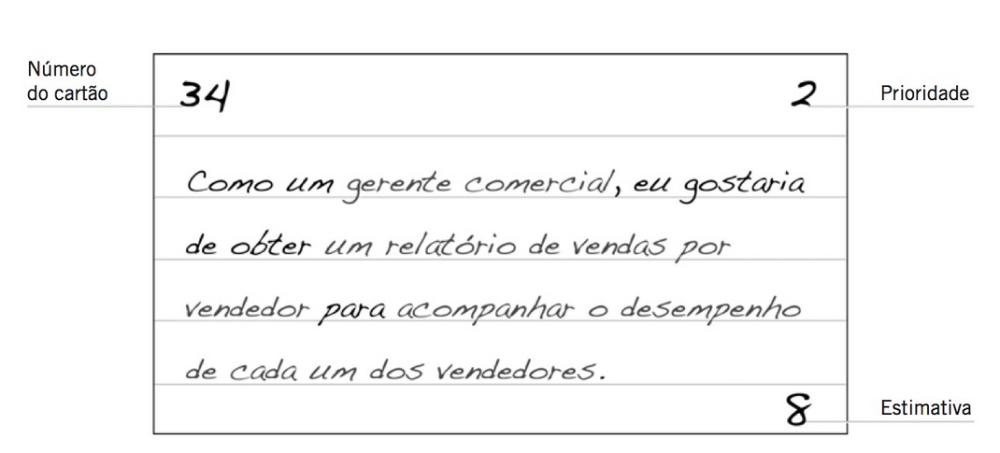

# Métodos Ágeis

Segundo Prikladinicki et. al em seu livro "Métodos Ágeis para Desenvolvimento de Software" (2014)[^1], o foco dos métodos 
ágeis está na pessoa e não no processo, o seu conjunto de valores, princípios e práticas. Isto permite a rápida 
adaptação à mudanças, ao invés de tentar prever tudo o que possa acontecer.

Segundo o autor:

> O termo "Métodos Ágeis" (também referenciado como Metodologias Ágeis) tornou-se popular em 2001 quando 17 
> especialistas em desenvolvimento de software representando diversas metodologias já existentes (XP, Scrum, DSDM, 
> Crystal e outras) estabeleceram princípios comuns a todas elas. O resultado foi a criação da Aliança Ágil e o 
> estabelecimento do Manifesto Ágil (2001). Os conceitos-chave são:
> 
> * indivíduos e interações mais que processos e ferramentas;
> * software funcionando mais que documentação abrangente;
> * colaboração com o cliente mais que negociação de contratos;
> * responder a mudanças mais que seguir um plano.
>
> O Manifesto Ágil não rejeita os processos nem as ferramentas, a documentação abrangente, a negociação de
> contratos ou o plano preestabelecido, mas indica que eles têm importância secundária quando comparados com
> indivíduos e interações, com software funcionando, com colaboração com o cliente e com respostas rápidas a
> mudanças. A questão não é a mudança em si, mesmo porque ela ocorre de forma frequente nos projetos. A questão
> é como receber, avaliar e responder a elas.
> 
> Além disso, os autores do Manifesto Ágil definiram 12 princípios:
> 
> * Nossa maior prioridade é satisfazer ao cliente com entrega contínua e adiantada de software com valor agregado. 
> * Mudanças de requisitos são bem-vindas, mesmo tardiamente no desenvolvimento. Os processos ágeis tiram vantagem das 
>   mudanças, visando à vantagem competitiva para o cliente.
> * Entregar software funcionando frequentemente, de poucas semanas a poucos meses, com preferência para a escala menor 
>   de tempo. 
> * Pessoa de negócios e desenvolvedores devem trabalhar diariamente em conjunto por todo o projeto. 
> * Construa projetos em torno de indivíduos motivados. Dê a eles o ambiente e o suporte necessário e confie neles para 
>   realizar o trabalho. 
> * O método mais eficiente e eficaz de transmitir informações para a equipe e entre a equipe de desenvolvimento é a 
>   conversa frente a frente. 
> * Software funcional é a medida primária de progresso. 
> * Processos ágeis promovem um desenvolvimento sustentável. Os patrocinadores, desenvolvedores e usuários devem ser 
>   capazes de manter um ritmo constante sempre. 
> * Contínua atenção à excelência técnica e bom projeto aumenta a agilidade. 
> * Simplicidade - a arte de maximizar a quantidade de trabalho não realizado - é essencial.
> * As melhores arquiteturas, os melhores requisitos e projetos emergem de times auto-organizáveis. 
> * Em intervalos regulares, o time reflete sobre como pode ser mais eficaz, então refina e ajusta seu comportamento de 
>   acordo.

## Diferenças entre métodos prescritivos e métodos ágeis

|                                         | TRADICIONAL                                                                                                          | METODOLOGIAS ÁGEIS                                                                                                                                                                                |
|:----------------------------------------|:---------------------------------------------------------------------------------------------------------------------|:---------------------------------------------------------------------------------------------------------------------------------------------------------------------------------------------------|
| Pressupostos fundamentais               | Sistemas totalmente especificáveis, previsíveis; desenvolvidos a partir de um planejamento extensivo e meticuloso  | Software adaptativo e de alta qualidade; pode ser desenvolvido por equipes pequenas utilizando os princípios da melhoria contínua do projeto e testes orientados a rápida resposta a mudanças  |
| Controle                                | Orientado a processos                                                                                                | Orientado a pessoas                                                                                                                                                                                |
| Estilo de gerenciamento                 | Comandar e controlar                                                                                                 | Liderar e colaborar                                                                                                                                                                                |
| Gestão do conhecimento                 | Explícito                                                                                                           | Tácito                                                                                                                                                                                            |
| Atribuição de papéis                 | Individual – favorece a especialização                                                                             | Times auto-organizáveis – favorece a troca de papéis                                                                                                                                             |
| Comunicação                           | Formal                                                                                                               | Informal                                                                                                                                                                                           |
| Ciclo do projeto                        | Guiado por tarefas ou atividades                                                                                     | Guiado por funcionalidades do produto                                                                                                                                                              |
| Modelo de desenvolvimento               | Modelo de ciclo de vida (Cascata, Espiral, ou alguma variação)                                                     | Modelo iterativo e incremental de entregas                                                                                                                                                         |
| Forma/estrutura organizacional desejada | Mecânica (burocrática com muita formalização)                                                                    | Orgânica (flexível e com incentivos a participação e cooperação social)                                                                                                                      |

### Exemplo de método ágil: Scrum

[Scrum](https://en.wikipedia.org/wiki/Scrum_(software_development)) é um dos vários frameworks de desenvolvimento ágil. 
Ele foi criado inicialmente pelas obervações das práticas manufatureiras da Toyota, e posteriormente formalizado por 
Ken Schwaber e Jeff Sutherland nos anos 90. Seu nome (Scrum) advém de um movimento feito no rugby, onde uma equipe tenta
avançar no campo por passes e jogadas coordenadas.

O Scrum deve ser entendido como um framework genérico, que descreve em alto nível o papel dos atores envolvidos, os 
artefatos gerados e as cerimônias que devem ser tomadas após cada etapa. Segundo Prikladinicki e Magno[^1], ele pode ser
descrito da seguinte forma:

* Três papéis: Dono do Produto, ScrumMaster, e Equipe de Desenvolvimento;
* Três artefatos: Backlog do Produto, Incremento do Produto, e Backlog da Sprint;
* Quatro cerimônias: reunião de planejamento da Sprint, Scrum diárias, Revisão da Sprint, e Retrospectiva da Sprint.

### Outro exemplo de método ágil: eXtreme Programming

eXtreme Programming (abreviado para XP) foi criado por Kent Beck depois de um trabalho realizado na montadora Chrysler.
Ele advém de uma experiência de Beck em criar um software para folha de pagamento que já vinha tendo um desenvolvimento
arrastado. Ao empregar uma nova metodologia de desenvolvimento, adepta de mudanças radicais nos requisitos, conseguiu
desenvolver o software com qualidade, tornando-se um case de sucesso da Engenharia de Software. Ela é pautada por 
revisão de código, integração rápida, testes automatizados, feedback do cliente e design simples. 

Segundo Prikladinicki[^1] em seu livro:

> A Programação Extrema usa boas práticas de engenharia de software de forma intensiva, o tempo todo! Se imaginarmos
> que essas práticas podem ser controladas por botões que regulam as suas intensidades, XP os posiciona na potência
> máxima. Por exemplo, se revisar o código é bom, então a revisão do código é feita constantemente por
> programação em pares. Se testar aumenta a qualidade, então testes automatizados aumentarão mais ainda a
> qualidade e também facilitarão a tarefa de validação. Se testar antes de entregar evita erros, então fazer
> Desenvolvimento Orientado a Testes (TDD) será melhor ainda. Se a opinião do cliente fornece feedback e direcionamento
> para o desenvolvimento, então ter o acompanhamento constante do cliente validará cada funcionalidade. Todas essas
> são boas práticas de engenharia de software que, em XP, são realizadas ao extremo.
> 
> A proposta de XP não é ser uma metodologia radicalmente técnica e imediatista. O extremismo vem da proposta de usar ao
> máximo as boas práticas de engenharia de software já reconhecidas pela indústria. Sobretudo, o poder de XP está no 
> conjunto das práticas. XP é um conjunto de práticas que se apoiam, criando sinergia.

Seus princípios são:

* Humanidade
* Economia
* Melhoria
* Benefício mútuo
* Semelhança
* Diversidade
* Passos pequenos
* Reflexão
* Fluxo
* Oportunidade
* Redundância
* Falha
* Qualidade
* Aceitação de responsabilidade

E seus valores são:

* Comunicação
* Simplicidade
* Coragem
* Feedback
* Respeito

#### Atores
 
* **Coach:** é a "consciência" da equipe, e a pessoa que garante que as práticas da XP estão sendo seguidas. Porém, 
  essa figura não é o "chefe", e não cobra entregas nem pressiona os membros da equipe. O coach também não tem voto
  definitivo na modelagem ou arquitetura do software, possuindo o mesmo peso de voto que os outros membros da equipe.
  O coach deve ser desempenhado pelo programador que tiver mais experiência em XP da equipe, e deve relembrar a equipe
  de seguir as práticas dessa metodologia. Caso mais de um programador tenha bastante experiência em XP, este papel
  pode ser revezado.
* **Tracker:** o tracker é um desenvolvedor responsável por coletar métricas sobre o projeto e disponibilizá-las à 
  equipe, de maneira que a mesma possa identificar pontos fortes e fracos no desenvolvimento do software e agir sobre.
  Podem ser métricas o número de histórias de usuário entregues, número de commits diários, número de builds, testes,
  cobertura do código, gráfico Burn-Down, etc.
* **Cliente:** O cliente é a pessoa que contrata o software, e que tem conhecimento das regras de negócio e sabe o que
  deve ser priorizado em seu desenvolvimento. O cliente deve estar disposto a participar de reuniões e esclarecer 
  dúvidas dos desenvolvedores, de maneira a facilitar a comunicação e sanar dúvidas pertinentes quando estas aparecem.
  
#### Artefatos

Na XP, geram-se poucos artefatos. Idealmente, o código-fonte bem-documentado e os testes automatizados devem ser 
suficientes para explicar o uso do software para programadores que não participaram do desenvolvimento do mesmo.
Todavia, às vezes pode ser necessário desenvolver outros artefatos para atender à legislação, por exemplo.

Podem ser gerados cartões de história, que são pequenas fichas de papel e servem para os clientes e usuários 
descreverem ou desenharem as funcionalidades que desejam no sistema. 

Além disso, podem ser usadas metáforas para explicar o que o sistema deve fazer e como deve se comportar. Uma boa 
metáfora normaliza o nome das estruturas internas do código-fonte (e.g. nomes de classes) e a arquitetura que o sistema
deve possuir.

#### Cerimônias

* **Jogo do planejamento:** é realizado no início de um novo ciclo de desenvolvimento, e envolve as atividades de 
  escrita de cartões de história, estimativa de custo, priorização de cartões, e resolução de dúvidas com o cliente.
* **Releases:** Uma versão do software que entra em produção. Pode durar de algumas semanas à alguns meses, e é composta
  por várias iterações. As funcionalidades que entram em produção juntas devem ser escolhidas de maneira que agreguem
  valor ao software sendo produzido. 
* **Iterações:** Um ciclo de desenvolvimento no qual novas funcionalidades são entregues ao cliente, que pode decidir
  se coloca em produção ou não. É composta de alguns dias até algumas semanas.

#### Práticas de desenvolvimento

* Testes automatizados
* Refatorações
* Programação em pares
* Padronização de código
* Propriedade coletiva
* Repositório de Código
* Integração contínua

## Bibliografia 

[^1]: Prikladinicki, R., de Almeida, E. S., & de Souza, J. T. (2014). Métodos ágeis para desenvolvimento de software. 
Disponível [neste link](https://integrada.minhabiblioteca.com.br/reader/books/9788582602089). Acesso em 30/07/2025.