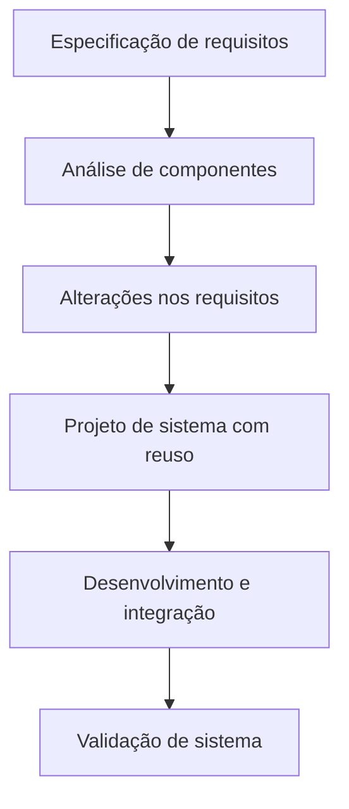

# Processo de Software

Um **processo de software** é um conjunto coerente de atividades para a produção de software[^1]. Existem muitos 
processos de software diferente, mas todos devem incluir quatro atividades fundamentais:

* _Especificação de Software:_ Requisitos funcionais e não-funcionais do software, bem como restrições
* _Projeto e implementação de software:_ Codificação e configuração de hardware, redes e softwares correlatos
* _Validação de software:_ Validação para garantir que atende às necessidades do cliente (e.g. testes)
* _Evolução de software:_ Adaptação à novas demandas do cliente no decorrer do tempo

## Modelos de Processo de Software

Existem **diversos** modelos de processo de software. Os exemplos trazidos nesta seção **não são** a totalidade do que
há disponível na literatura, mas tão somente um subconjunto explicativo.

### Modelo em cascata

O modelo em cascata é um modelo linear, em que apenas se adentra a uma etapa após concluir todas as tarefas da etapa 
anterior. Caso alguma tarefa fique pendente ou incompleta, proveniente de uma etapa anterior, então o projeto não deve
avançar até que todas as pendências sejam resolvidas.

Esse modelo de processo de software é adequado quando conhece-se de antemão todos os requisitos do sistema, e é 
improvável que eles sejam modificados no futuro, como software embarcado, construção de sistemas críticos (e.g. a 
corrida espacial dos anos 60), dentre outros sistemas.

### Modelo incremental

"O desenvolvimento incremental é baseado na ideia de desenvolver uma versão inicial, expô-la aos comentários dos 
usuários, e continuar por meio da criação de várias versões até que um sistema adequado seja desenvolvido"[^1].

O modelo incremental é mais adequado a sistemas que mudam de requisitos a cada rodada de desenvolvimento, ou que possuem
especificações para as quais não se conhece a totalidade do cenário a ser implementado (por exemplo, funcionalidades em 
uma rede social). Este é um modelo usado principalmente pelos metodos ágeis.

Em contrapartida, o modelo incremental possui duas desvantagens frente ao modelo em cascata:

* A tendência é que a estrutura interna do software se degrade a medida que novos recursos são adicionados, exigindo que
  refatoração seja utilizada. Do contrário, novas modificações no sistema serão difíceis e onerosas.
* É difícil acompanhar a progressão do projeto. Os gerentes de projeto precisam de entregas regulares para mensurar o 
  progresso do desenvolvimento. Por outro lado, se o software for desenvolvido muito rapidamente, não é economicamente
  viável gerar artefatos (e.g. documentação) para cada versão do software.

### Modelo orientado a reuso

O modelo de software orientado a reuso reutiliza componentes já desenvolvidos de outros projetos. Por exemplo, podemos
considerar a biblioteca [Bootstrap](https://getbootstrap.com) como um exemplo simples dessa prática. Todavia, componentes
específicos (como interfaces de acesso a banco de dados, entrada e saída, etc) também podem ser reutilizados.

## Atividades do processo

### Especificação

### Projeto e implementação

### Validação

### Evolução

## Bibliografia

[^1]: Sommerville, I. Engenharia de Software. 9ª Edição. (2011).