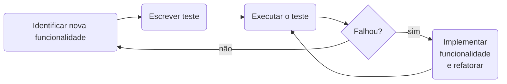

# Test-Driven Development

O desenvolvimento orientado a testes (TDD, Test-Driven Development) foi inicialmente proposto por Kent Beck como parte
integrante da metodologia Extreme Programming (XP)[^1]. A ideia é que o desenvolvedor escreva os testes _antes_ de 
começar a desenvolver a nova funcionalidade. É considerada uma técnica de design de software, e não de testes. 

Segundo Prikladinicki[^1], o Desenvolvimento orientado a testes deve seguir os seguintes passos:

1. Escreva um teste automatizado, antes de escrever qualquer código de produção.
2. Execute o teste. Ele **deve** falhar! Isso prova que a funcionalidade ainda não foi implementada.
3. Como o **teste** funciona mas o código-fonte que deveria satisfazer o teste ainda não, isso quer
   dizer que temos conhecimento de uma nova funcionalidade que deve ser implementada, e **como** ela
   deve ser implementada.
4. Implemente o código-fonte que satisfaz as condições do teste.

O primeiro passo consiste em escrever um teste automatizado para uma funcionalidade que ainda não foi implementada. 
Apesar de parecer estranho, é bem fácil de fazer, já que se escreve o que se espera da funcionalidade antes de 
implementá-la, evitando vícios de implementação. A segunda consiste em aplicar [refatoração](REFATORACAO.md), uma 
técnica que visa mudar a implementação interna do código-fonte sem contudo mudar seu comportamento externo.

Os testes também podem ser utilizados como documentação do software, dado que descrevem no decorrer do tempo as 
funcionalidades implementadas (por um software de controle de versão, como o git).

Segundo Sommerville[^2], um diagrama de fluxo do Desenvolvimento Dirigido a Testes seria o seguinte:

>[!WARNING]
> Atenção! Testes unitários não são testes automatizados!
> 
> Com frequência, testes unitários são implementados de maneira automatizada. Porém, isto não é uma obrigatoriedade!
> Na verdade, outros tipos de teste podem ser também automatizados, como testes de integração (através de um framework
> como por exemplo [selenium](https://www.selenium.dev/)).

## Tipos de teste de software

### Unitários

Os testes unitários verificam pequenas funcionalidades de um software. Por exemplo, se tivermos um site que calcula aplicações financeiras e tributos, podemos ter tantos testes unitários quanto tivermos aplicações financeiras (e.g. CDB, Ouro, Ações, Tesouro Direto), e tributos (ICMS, IOF, Imposto de Renda, etc).

### De Componentes

Testes de componente **não são** um coletivo de testes unitários, mas sim uma maneira de testar um componente de maneira isolada. No nosso exemplo anterior, um componente pode ser a página do site que mostra as aplicações financeiras. Teríamos então um teste de componente para ver se todas as opções de aplicações estão sendo listadas, se é possível inserir valores em campos de texto, etc.

### Integração

Os testes de integração verificam o conjunto de componentes de software. No exemplo anterior, o site inteiro poderia ser testado: a página inicial, a página de aplicações financeiras, a página de cálculo de tributos, a página de contato, etc.

## Escrevendo testes unitários

O repositório [CTISM-Prof-Henry/softwareTesting](https://github.com/CTISM-Prof-Henry/softwareTesting) traz exemplos de como
escrever testes unitários automatizados nas linguagens Java, Python e Javascript.

## Cobertura

A cobertura de um conjunto de testes automatizados e unitários de software consiste em calcular quantos % do código está
coberto (executado) pelos testes. Apesar de não ser uma relação 1:1 para a qualidade do software (por exemplo, um 
software pode estar totalmente coberto por testes unitários automatizados e ainda assim não fazer o que o cliente 
espera), é desejável que pelo menos a maioria do código-fonte seja testado antes de ser colocado em produção.

O repositório [CTISM-Prof-Henry/softwareTesting](https://github.com/CTISM-Prof-Henry/softwareTesting) traz exemplos de como
calcular a cobertura de testes nas linguagens Java, Python e Javascript.

## Bibliografia

[^1]: Prikladinicki, R., de Almeida, E. S., & de Souza, J. T. (2014). Métodos ágeis para desenvolvimento de software. 
Disponível [neste link](https://integrada.minhabiblioteca.com.br/reader/books/9788582602089). Acesso em 30/07/2025.
[^2]: Sommervile, I. Engenharia de Software. 9ª Edição. (2011).
