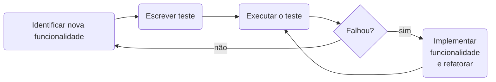
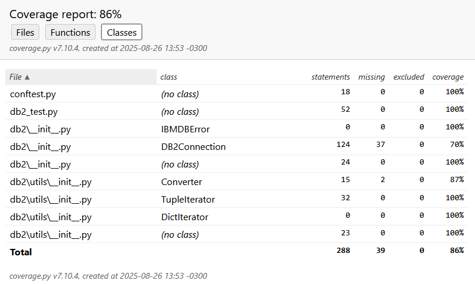
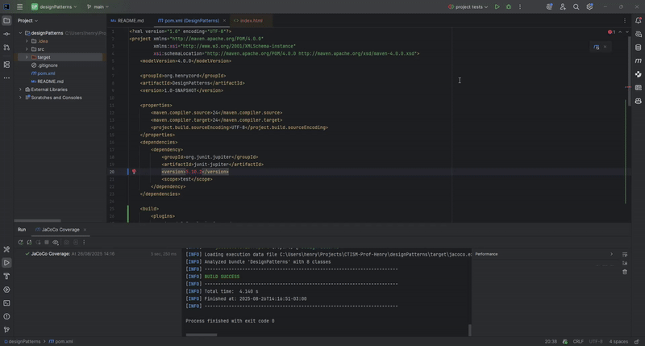
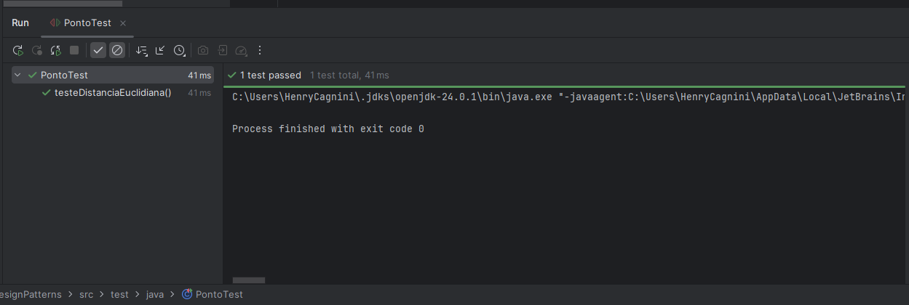
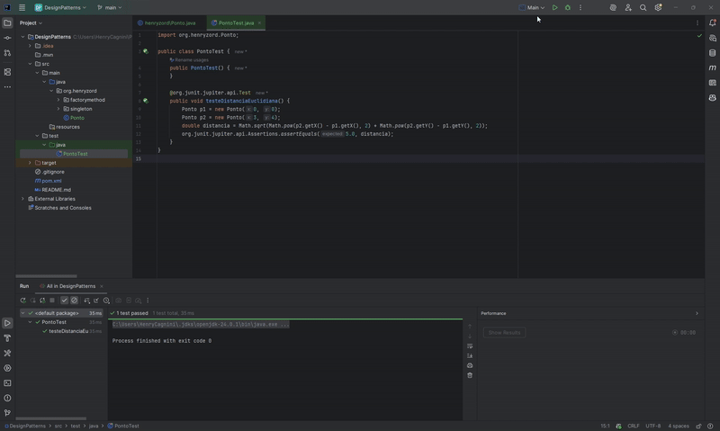
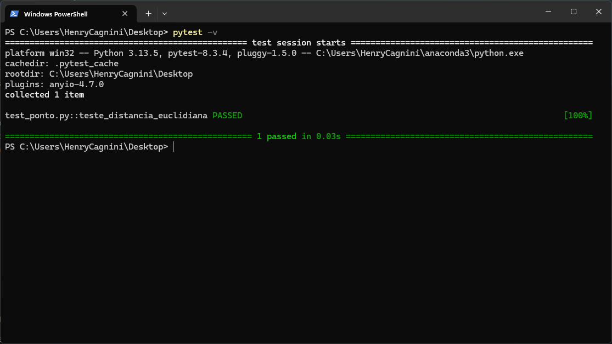

# Test-Driven Development

O desenvolvimento orientado a testes (TDD, Test-Driven Development) foi inicialmente proposto por Kent Beck como parte
integrante da metodologia Extreme Programming (XP)[^1]. A ideia é que o desenvolvedor escreva os testes _antes_ de 
começar a desenvolver a nova funcionalidade. É considerada uma técnica de design de software, e não de testes. 

Segundo Prikladinicki[^1], o Desenvolvimento orientado a testes deve seguir os seguintes passos:

1. Escreva um teste automatizado, antes de escrever qualquer código de produção.
2. Remova duplicações.

O primeiro passo consiste em escrever um teste automatizado para uma funcionalidade que ainda não foi implementada. 
Apesar de parecer estranho, é bem fácil de fazer, já que se escreve o que se espera da funcionalidade antes de 
implementá-la, evitando vícios de implementação. A segunda consiste em aplicar [refatoração](REFATORACAO.md), uma 
técnica que visa mudar a implementação interna do código-fonte sem contudo mudar seu comportamento externo.

Os testes também podem ser utilizados como documentação do software, dado que descrevem no decorrer do tempo as 
funcionalidades implementadas (por um software de controle de versão, como o git).

Segundo Sommerville[^2], um diagrama de fluxo do Desenvolvimento Dirigido a Testes seria o seguinte:



>[!WARNING]
> Atenção! Testes unitários não são testes automatizados!
> 
> Com frequência, testes unitários são implementados de maneira automatizada. Porém, isto não é uma obrigatoriedade!
> Na verdade, outros tipos de teste podem ser também automatizados, como testes de integração (através de um framework
> como por exemplo [selenium](https://www.selenium.dev/)).


## Tipos de teste de software

### Unitários

Os testes unitários verificam pequenas funcionalidades de um componente. Por exemplo, se tivermos uma classe 
`Calculadora`, podem-se escrever tantos testes unitários quanto forem os métodos da calculadora (e.g. `testaSoma`, 
`testaMultiplicacao`, etc).

### De Componentes

Um teste de componente assume um componente completo (e.g. `Calculadora`) de forma isolada, testando sua lógica interna
e sua interação com interfaces externas. Outros componentes **não são** testados em conjunto quando testa-se um 
componente em específico; são usadas entradas simuladas (mock ups), com um retorno esperado. Por exemplo, para testar
o método `soma` da classe `Calculadora`, simula-se a digitação de dois números, com o resultado esperado já conhecido.

### Integração

Os testes de integração verificam a interface entre componentes e como eles se comunicam. Por exemplo, pode-se testar 
como um componente `Teclado` coleta as informações digitadas pelo usuário e as repassa para o componente `Calculadora`.

### Funcionais/Aceitação

São testes que avaliam o sistema do ponto de vista da interface externa (por exemplo, a interface Web de um site), 
levando em consideração a perspectiva do usuário final que fará uso do software. Testes funcionais garantem que o 
sistema realiza as funções esperadas, enquanto testes de aceitação validam que o sistema atende aos requisitos acordados 
com o cliente ou usuário final.

## Cobertura

A cobertura de um conjunto de testes automatizados e unitários de software consiste em calcular quantos % do código está
coberto (executado) pelos testes. Apesar de não ser uma relação 1:1 para a qualidade do software (por exemplo, um 
software pode estar totalmente coberto por testes unitários automatizados e ainda assim não fazer o que o cliente 
espera), é desejável que pelo menos a maioria do código-fonte seja testado antes de ser colocado em produção.

Em Python, é possível ver a cobertura dos testes com a biblioteca `coverage`, pela linha de comando:

```bash
pip install coverage
coverage run -m pytest -v
coverage report  # gera um relatório na linha de comando
coverage html  # gera um relatório em HTML
```

O relatório em HTML terá o seguinte aspecto, onde é possível ver a cobertura de arquivos, funções e classes (você 
também pode conferí-lo [aqui](../html/python_coverage.html)):



Em Java, a ferramenta para verificar a cobertura mais popular é o JaCoCo. 

Você pode configurá-la no Intellij IDEA da seguinte forma:

1. Adicione os seguintes plugins ao seu `pom.xml` (**NOTA:** as versões dos plugins e bibliotecas mudarão no futuro e 
   este tutorial ficará defasado. Consulte um tutorial mais atualizado na internet!):

   ```xml
   <build>
        <plugins>
            <!-- JaCoCo plugin for code coverage -->
            <plugin>
                <groupId>org.jacoco</groupId>
                <artifactId>jacoco-maven-plugin</artifactId>
                <version>0.8.13</version>
                <executions>
                    <!-- Attach JaCoCo agent while running tests -->
                    <execution>
                        <goals>
                            <goal>prepare-agent</goal>
                        </goals>
                    </execution>
                    <!-- Generate report after tests -->
                    <execution>
                        <id>report</id>
                        <phase>verify</phase>
                        <goals>
                            <goal>report</goal>
                        </goals>
                    </execution>
                </executions>
            </plugin>
            <plugin>
                <groupId>org.apache.maven.plugins</groupId>
                <artifactId>maven-surefire-plugin</artifactId>
                <version>3.2.5</version>
            </plugin>
            <plugin>
                <groupId>org.apache.maven.plugins</groupId>
                <artifactId>maven-compiler-plugin</artifactId>
                <version>3.13.0</version>
                <configuration>
                    <release>21</release>
                </configuration>
            </plugin>
        </plugins>
    </build>
   ```
   
2. Crie uma nova configuração de execução do Maven:
   
   

3. Um relatório em HTML é gerado e armazenado em `target/site/jacoco/index.html` (você também pode vê-lo 
   [aqui](../html/jacoco.html)):
 
   

## Escrevendo testes unitários

### Com JUnit

JUnit é o framework de testes unitários automatizados do Java. Para utilizá-lo:

1. Adicione a biblioteca ao seu arquivo `pom.xml`:

   ```xml
   <dependencies>
       <dependency>
           <groupId>org.junit.jupiter</groupId>
           <artifactId>junit-jupiter</artifactId>
           <version>5.10.2</version> <!-- coloque a última versão disponível ou a última compatível com seu projeto -->
           <scope>test</scope>
       </dependency>
   </dependencies>
   ```

2. Crie uma pasta `test` dentro da pasta `src`. Para cada classe que você desejar testar, crie um arquivo 
   `<nome_da_classe>Test.java`. Por exemplo, se você tem uma classe chamada `Ponto` em 
   `src/main/java/org.henryzord.Ponto.java`, crie um arquivo `PontoTest.java` em 
   `src/test/java/org.henryzord.PontoTest.java`.
3. Supondo que seu código-fonte da classe `Ponto` seja o seguinte:
   ```java
   package org.henryzord;

   public class Ponto {
       private final float x;
       private final float y;
   
       public Ponto(float x, float y) {
           this.x = x;
           this.y = y;
       }
   
       public float getX() {
           return x;
       }
   
       public float getY() {
           return y;
       }
   
       public float distanciaEuclidiana(Ponto outro) {
           return (float) Math.sqrt(Math.pow(this.x - outro.x, 2) + Math.pow(this.y - outro.y, 2));
       }
   }
   ```

4. Escreva os testes da seguinte maneira:
   ```java
   import org.henryzord.Ponto;

   import org.junit.jupiter.api.Assertions;
   
   public class PontoTest {
       public PontoTest() {
       }
   
       @org.junit.jupiter.api.Test
       public void testeDistanciaEuclidiana() {
           Ponto p1 = new Ponto(0, 0);
           Ponto p2 = new Ponto(3, 4);
           double distancia = Math.sqrt(Math.pow(p2.getX() - p1.getX(), 2) + Math.pow(p2.getY() - p1.getY(), 2));
           Assertions.assertEquals(5.0, distancia);
       }
   }
   ```

5. Você pode rodar os testes individualmente (executando cada classe). A saída esperada deve ser algo como:

   

6. Você também pode criar uma configuração na IDE para rodar todos os testes do projeto de uma só vez. O exemplo abaixo
   considera a IDE Intellij IDEA:

   

7. Os seguintes métodos da classe Assertions são importantes para escrever testes com JUnit. Todas elas lançam exceções
   em caso de falha:
   
   * `Assertions.assertEquals(expected, actual)`: Verifica se dois valores são iguais.  
   * `Assertions.assertTrue(condition)`: Verifica se um item é verdadeiro.
   * `Assertions.assertFalse(condition)`: Verifica se um item é falso.
   * `Assertions.assertThrows(Exception.class, () -> { ... })`: Verifica se uma classe lança uma exceção quando uma 
      condição é atendida.
   * `Assertions.assertAll(...)`: agrupa múltiplas verificações em uma chamada só. 

### Com pytest

Da mesma maneira que Java conta com JUnit para teste unitários automatizados, Python conta com pytest. O funcionamento é
parecido com JUnit, mas é possível agrupar diversos testes em um arquivo.

> [!WARNING]
> Java usa `CamelCase` para nomes de arquivos, classes e métodos, enquanto Python usa `snake_case` para nomes de 
> arquivos e métodos. 

1. Instale pytest com o comando `pip install pytest`
2. Supondo que você tenha um arquivo `ponto.py` com o seguinte código:
   
   ```python
   class Ponto(object):
        def __init__(self, x: float, y: float):
            self._x = x
            self._y = y

        @property 
        def x(self):
            return self._x

        @property
        def y(self):
            return self._y

        def distancia_euclidiana(self, outro) -> float:
            return ((self.x - outro.x)**2 + (self.y - outro.y)**2)**(1./2.)
   ```
   
3. Em um arquivo `test_ponto.py`, escreva o seguinte código (pode colocá-lo no mesmo diretório do arquivo ponto.py):

   ```python
   import pytest
   from ponto import Ponto
   
   
   def teste_distancia_euclidiana():
       p1 = Ponto(0, 0)
       p2 = Ponto(3, 4)
       # distância esperada: sqrt(3^2 + 4^2) = 5
       assert pytest.approx(p1.distancia_euclidiana(p2), rel=1e-6) == 5.0
   ```

4. No diretório que estão os arquivos `ponto.py` e `test_ponto.py`, execute, pela linha de comando:
   ```bash
   pytest -v
   ```
   
5. A saída esperada deve ser algo como:

   


### Com QUnit

Em breve!


## Exercícios

Para cada um dos exercícios abaixo, você deve criar uma classe que encapsule a lógica de negócio, e testes unitários
automatizados para verificar as funcionalidades.

1. **Sistema de Biblioteca (Java)**

   - Crie uma classe `Livro` com os atributos `titulo`, `autor`, `isbn` e `disponivel`.
   - Crie uma classe `Usuario` com os atributos `nome` e `idUsuario`.
   - Crie uma classe `Biblioteca` que gerencie empréstimos, implementando:
     - `emprestarLivro(Livro livro, Usuario usuario)` — só permita empréstimos se o livro estiver disponível.
     - `devolverLivro(Livro livro)` — marque o livro como disponível.
     - Mantenha um histórico de empréstimos.
   - Escreva testes unitários para:
     - Empréstimos de livros disponíveis e indisponíveis.
     - Devolução de livros.
     - Integridade do histórico de empréstimos.

2. **Sistema de Carrinho de Compras (Python)**

   - Crie uma classe `Produto` com os atributos `nome` e `preco`.
   - Crie uma classe `Carrinho` que gerencie produtos, implementando:
     - `adicionar_produto(produto)`
     - `remover_produto(produto)`
     - `calcular_total()` — aplique descontos progressivos:
       - 3 ou mais produtos → 5% de desconto.
       - Total acima de 500 → 10% de desconto.
     - Permita produtos duplicados.
   - Escreva testes unitários para:
     - Diferentes combinações de descontos.
     - Adição e remoção de produtos, recalculando o total.
     - Comportamento com carrinho vazio.

3. **Gerenciador de Contas Bancárias (Java)**

   - Crie uma classe `ContaBancaria` com os atributos `titular`, `numeroConta` e `saldo`.
   - Implemente métodos:
     - `depositar(double valor)`
     - `sacar(double valor)` — lance exceção se o saldo for insuficiente.
     - `transferir(ContaBancaria destino, double valor)` — atualize o saldo das duas contas.
   - Escreva testes unitários para:
     - Saques maiores que o saldo.
     - Transferências entre contas.
     - Depósitos.
     - Integridade do saldo após múltiplas operações.

4. **Sistema de Pedidos com Estados (Java ou Python)**

   - Crie uma classe `Pedido` com os estados `CRIADO`, `PAGO`, `ENVIADO`, `ENTREGUE` e `CANCELADO`.
   - Implemente métodos de transição: `pagar()`, `enviar()`, `entregar()`, `cancelar()`.
   - Lance exceções para transições inválidas.
   - Escreva testes unitários para:
     - Todas as transições válidas.
     - Transições inválidas lançando exceção.
     - Estado final do pedido após múltiplas operações.

## Bibliografia

[^1]: Prikladinicki, R., de Almeida, E. S., & de Souza, J. T. (2014). Métodos ágeis para desenvolvimento de software. 
Disponível [neste link](https://integrada.minhabiblioteca.com.br/reader/books/9788582602089). Acesso em 30/07/2025.
[^2]: Sommervile, I. Engenharia de Software. 9ª Edição. (2011).