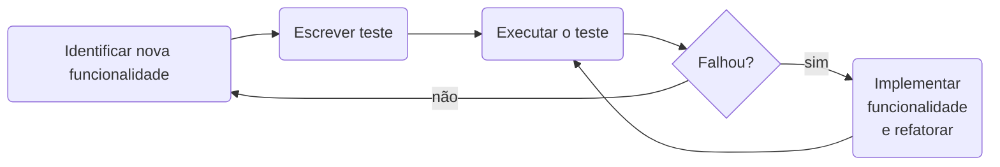

# Test-Driven Development

O desenvolvimento orientado a testes (TDD, Test-Driven Development) foi inicialmente proposto por Kent Beck como parte
integrante da metodologia Extreme Programming (XP)[^1]. A ideia é que o desenvolvedor escreva os testes _antes_ de 
começar a desenvolver a nova funcionalidade. É considerada uma técnica de design de software, e não de testes. 

Segundo Sommerville[^2], um diagrama de fluxo do Desenvolvimento Dirigido a Testes seria o seguinte:

## Bibliografia

[^1]: Prikladinicki, R., de Almeida, E. S., & de Souza, J. T. (2014). Métodos ágeis para desenvolvimento de software. 
Disponível [neste link](https://integrada.minhabiblioteca.com.br/reader/books/9788582602089). Acesso em 30/07/2025.