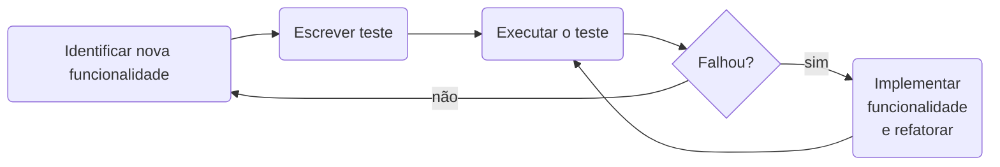

# Test-Driven Development

O desenvolvimento orientado a testes (TDD, Test-Driven Development) foi inicialmente proposto por Kent Beck como parte
integrante da metodologia Extreme Programming (XP)[^1]. A ideia é que o desenvolvedor escreva os testes _antes_ de 
começar a desenvolver a nova funcionalidade. É considerada uma técnica de design de software, e não de testes. 

Segundo Sommerville[^2], um diagrama de fluxo do Desenvolvimento Dirigido a Testes seria o seguinte:

A ideia é que o desenvolvedor escreva testes automáticos antes de desenvolver as funcionalidades que serão testadas. 
Desta maneira, é possível saber, de antemão, qual o comportamento desejado do software. Os testes também podem ser 
utilizados como documentação do software, dado que descrevem no decorrer do tempo as funcionalidades implementadas 
(por um software de controle de versão, como o git).

>[!WARNING]
> Atenção! Testes unitários não são testes automatizados!
> 
> Com frequência, testes unitários são implementados de maneira automatizada. Porém, isto não é uma obrigatoriedade!
> Na verdade, outros tipos de teste podem ser também automatizados, como testes de integração (através de um framework
> como por exemplo [selenium](https://www.selenium.dev/)).

## Tipos de teste de software

### Unitários

Os testes unitários verificam pequenas funcionalidades de um componente. Por exemplo, se tivermos uma classe 
`Calculadora`, podem-se escrever tantos testes unitários quanto forem os métodos da calculadora (e.g. `testaSoma`, 
`testaMultiplicacao`, etc).

### De Componentes

Um teste de componente assume um componente completo (e.g. `Calculadora`) de forma isolada, testando sua lógica interna
e sua interação com interfaces externas. Outros componentes **não são** testados em conjunto quando testa-se um 
componente em específico; são usadas entradas simuladas (mock ups), com um retorno esperado. Por exemplo, para testar
o método `soma` da classe `Calculadora`, simula-se a digitação de dois números, com o resultado esperado já conhecido.

### Integração

Os testes de integração verificam a interface entre componentes e como eles se comunicam. Por exemplo, pode-se testar 
como um componente `Teclado` coleta as informações digitadas pelo usuário e as repassa para o componente `Calculadora`.

### Funcionais/Aceitação

São testes que avaliam o sistema do ponto de vista da interface externa (por exemplo, a interface Web de um site), 
levando em consideração a perspectiva do usuário final que fará uso do software. Testes funcionais garantem que o 
sistema realiza as funções esperadas, enquanto testes de aceitação validam que o sistema atende aos requisitos acordados 
com o cliente ou usuário final.

## Bibliografia

[^1]: Prikladinicki, R., de Almeida, E. S., & de Souza, J. T. (2014). Métodos ágeis para desenvolvimento de software. 
Disponível [neste link](https://integrada.minhabiblioteca.com.br/reader/books/9788582602089). Acesso em 30/07/2025.
[^2]: Sommervile, I. Engenharia de Software. 9ª Edição. (2011).