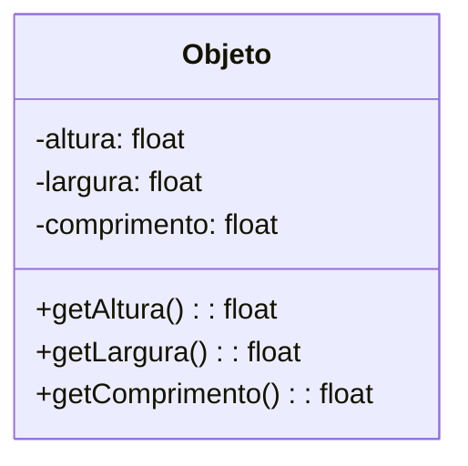
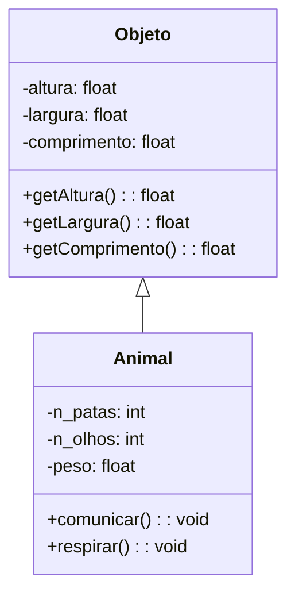
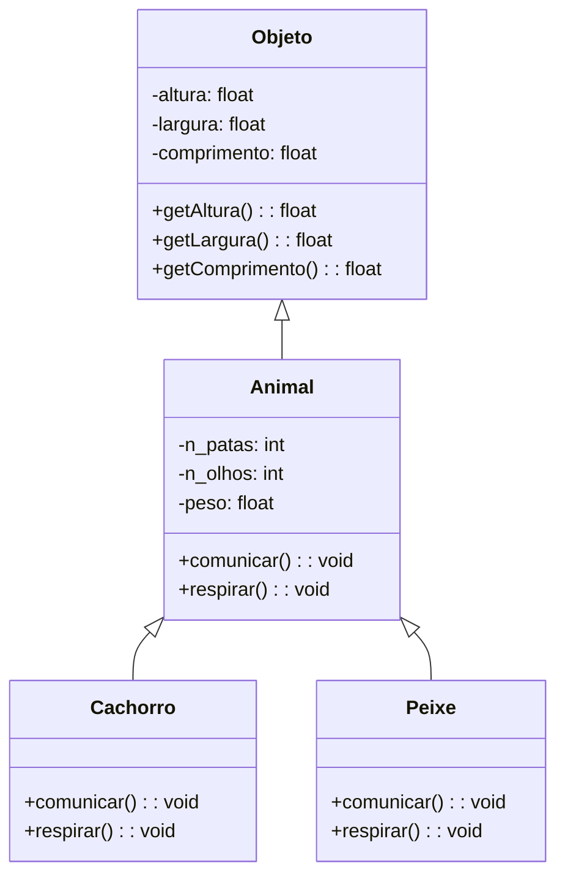
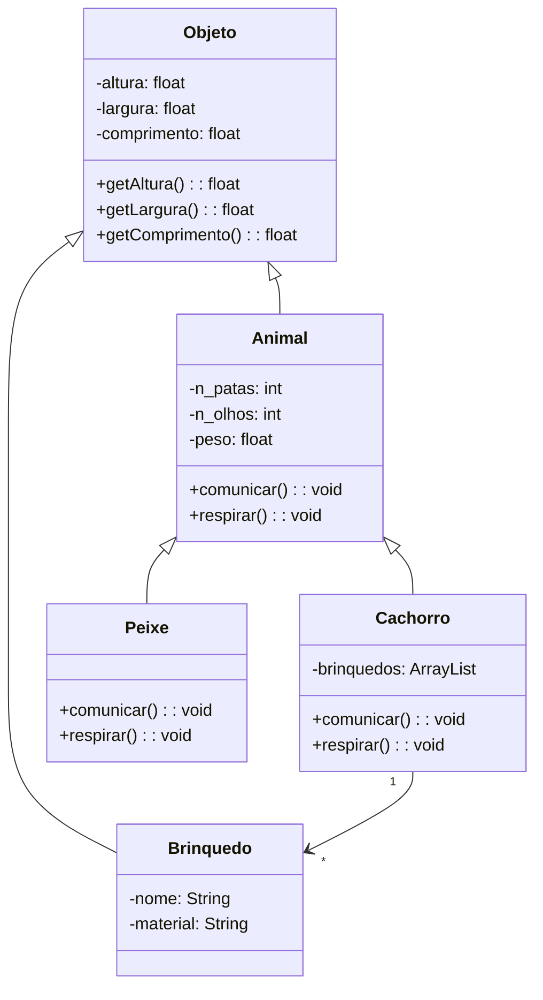

# Unified Modeling Language

A UML (Unified Modeling Language) é uma linguagem de modelagem padronizada utilizada para especificar, visualizar,
construir e documentar sistemas de software, especialmente os orientados a objetos. Ela surgiu na década de 1990, quando
diferentes notações de modelagem começaram a ser unificadas com o objetivo de criar uma linguagem comum, compreensível
por desenvolvedores, analistas e gestores de projetos.

A UML não é uma metodologia de desenvolvimento, mas sim uma linguagem de modelagem que pode ser aplicada em diferentes
abordagens, como o desenvolvimento ágil ou tradicional. Sua função é facilitar a comunicação entre os membros da equipe,
diminuir ambiguidades e servir de guia tanto para a análise quanto para a implementação de sistemas.

Um dos principais pontos fortes da UML é oferecer diferentes tipos de diagramas, cada um voltado a um aspecto do
sistema. Os diagramas podem ser divididos em duas categorias principais:

* Diagramas estruturais, que descrevem a parte estática do sistema, como classes, objetos, componentes e a arquitetura
  geral. O [diagrama de classes](#diagrama-de-classes) é um dos mais utilizados, pois mostra as classes, seus atributos, 
  métodos e relações.
* Diagramas comportamentais, que representam a dinâmica e o fluxo de atividades no sistema. Exemplos incluem o [diagrama
  de casos de uso](#diagrama-de-casos-de-uso), que mostra como os atores interagem com o sistema, e o diagrama de 
  sequência, que detalha a troca de mensagens entre objetos ao longo do tempo.

Existem diferentes ferramentas de modelagem UML. Nesta disciplina, usaremos a ferramenta online 
[Mermaid](https://mermaid.live):

* Os diagramas são programados com uma linguagem de marcação (mermaid) e são renderizados automaticamente;
* O código dos diagramas pode ser incorporado à documentação do GitHub.

## Tipos de Diagramas

### Diagrama de Classes

Segundo a [Wikipedia](https://en.wikipedia.org/wiki/Class_diagram):

> Na engenharia de software, um diagrama de classes na Linguagem de Modelagem Unificada (UML) é um tipo de diagrama de 
> estrutura estática que descreve a estrutura de um sistema mostrando as classes do sistema, seus atributos, operações 
> (ou métodos) e os relacionamentos entre os objetos.

> [!NOTE]
> Esse capítulo assume que você está um pouco familiarizado com o paradigma de orientação a objetos.

Os diagramas de classe permitem representar, de maneira visual, a estrutura das classes de um software e seu 
relacionamento com outras entidades.

Na linguagem mermaid, uma classe consiste em um retângulo com 3 subdivisões:

* A parte de cima dá o nome da classe;
* A parte do meio lista os atributos (características);
* A parte de baixo lista os métodos (comportamentos).

```
classDiagram    
    class Objeto {
        +altura: float
        +largura: float
        +comprimento: float
    }
```



O símbolo `+` indica que o atributo ou método tem acesso público (ou seja, pode ser acessado de fora do código-fonte 
da classe), enquanto o símbolo `-` denota atributos ou métodos privados (acesso apenas a partir de código-fonte interno 
à classe). No exemplo acima, `altura`, `largura` e `comprimento` são privados, enquanto os métodos `getAltura`, 
`getLargura` e `getComprimento` são públicos.

> [!NOTE]
> Os tipos de acesso da UML são:
> * `+`: Público
> * `-`: Privado
> * `#`: Protegido: acessível a partir de subclasses (classes que herdam a classe-base) e classes no mesmo pacote da 
>   classe-base
> * `~`: Pacote/interno: Acessível apenas a partir de classes no mesmo pacote (indisponível para classes herdeiras)

Para denotarmos uma herança no UML, traçamos uma seta entre as classes:

```
class Animal {
    -n_patas: int
    -n_olhos: int
    -peso: float
    +comunicar(): void
    +respirar(): void
}

Objeto <|-- Animal
```



No exemplo acima, a classe `Animal` __herda__ as características e comportamentos da classe `Objeto`. Ou seja, `Animal` 
possui, além de `n_patas`, `n_olhos` e `peso` as características `altura`, `largura` e `comprimento`, bem como os 
métodos _getters_ associados à eles. Além disso, a classe `Animal` adiciona novas características e comportamentos, como 
`comunicar()` e `respirar()`.

Vamos seguir no exemplo de especializar cada vez mais uma classe. Vamos criar as classes `Cachorro` e `Peixe`, que 
herdam a classe `Animal`:

```
class Cachorro {
    +comunicar(): void 
    +respirar(): void 
}

class Peixe {
    +comunicar(): void
    +respirar(): void
}

Animal <|-- Cachorro
Animal <|-- Peixe
```



Perceba como os métodos `comunicar` e `respirar` foram sobrescritos nas subclasses `Cachorro` e `Peixe`, já que estão
descritos novamente. Ou seja, o comportamento original, definido pela superclasse `Animal`, está sendo substituído por 
um novo comportamento nas subclasses.

Vamos supor agora que a classe `Cachorro` tenha um novo atributo `brinquedos`, que é um `ArrayList` de objetos do tipo 
`Brinquedo`. `Brinquedo` não é uma subclasse de `Cachorro`, mas sim uma classe **associada** à `Cachorro`. Nos diagramas
UML, representamos isso com uma seta simples entre as duas classes, onde a classe de onde parte a seta possui 
conhecimento da classe sendo apontada pela seta. Em outras palavras, uma classe faz uso dos métodos e atributos da 
outra, mas o inverso não é verdadeiro:

```
class Cachorro {
    -brinquedos: ArrayList<Brinquedo>

    +comunicar(): void
    +respirar(): void
}

class Brinquedo {
    -nome: String
    -material: String 
}

Objeto <|-- Brinquedo

Cachorro "1" -- "*" Brinquedo : possui >
```



> [!NOTE]
> A relação entre as classes pode ser **bidirecional**. Ou seja, as duas classes possuem conhecimento uma da outra. 
> Nesse caso, ao invés de uma seta simples, usaríamos apenas uma aresta: `Cachorro "1" -- "*" Brinquedo`.

> [!NOTE]
> Os números na associação entre as classes denotam a cardinalidade:
> * `Cachorro "1" -- "*" Brinquedo` significa que um cachorro possui entre 0 e N brinquedos;
> * `Cachorro "1" -- "1..*" Brinquedo` significa que um cachorro possui entre 1 e N brinquedos;
> * `Cachorro "*" -- "*" Brinquedo` significa um cachorro possui entre 0 e N brinquedos, e um brinquedo pode pertencer 
>   a entre 0 e N cachorros. 

#### Exercícios

1. Implemente em Java o diagrama de classe abaixo: 
   
   ```mermaid
    classDiagram
    class ContaBancaria {
        -cc: int
        -ag: int
        -titular: String
        -saldo: float
   
        +depositar(valor: float): void  
        +sacar(valor: float): float  
        +consultarSaldo(): float  
    }
   ```

2. Implemente em Java o diagrama de classe abaixo:

   ```mermaid
    classDiagram
        class Funcionario {
        -nome: String 
        -salario: float
        +exibirDados(): void
    }
    
    class Gerente {
        -departamento: String 
   
        +exibirDados(): void 
    }
    
    Funcionario <|-- Gerente
   ```

3. Desenhe o diagrama de classes correspondente no [mermaid.live](https://mermaid.live):

   ```java
    public class Produto {
        private int codigo;
        private String nome;
        private double preco;
    
        public Produto(int codigo, String nome, double preco) {
            this.codigo = codigo;
            this.nome = nome;
            this.preco = preco;
        }
        
        public double getPreco() {
            return preco;
        }
        
        public void exibirDados() {
            System.out.println(codigo + " - " + nome + " : R$ " + preco);
        }
    }
   ```

4. Desenhe o diagrama de classes correspondente no [mermaid.live](https://mermaid.live):
   
   ```java
    import java.util.ArrayList;
    import java.util.List;
    
    public class Biblioteca {
        private String nome;
        private List<Livro> livros = new ArrayList<>();
    
        public Biblioteca(String nome) {
            this.nome = nome;
        }
    
        public void adicionarLivro(Livro livro) {
            livros.add(livro);
        }
    }
    
    class Livro {
        private String titulo;
        private String autor;
        private int ano;
    }
   ```
 
5. Para o texto abaixo, implemente primeiro o diagrama UML de classes, e depois o código-fonte correspondente:
   > Modele um sistema simples para representar universidades e estudantes.
   > * Universidade possui nome e uma lista de Estudante.
   > * Estudante possui nome e matrícula.
   > * A universidade deve ter um método adicionarEstudante(Estudante e). 

6. Para o texto abaixo, implemente primeiro o diagrama UML de classes, e depois o código-fonte correspondente:
   > Modele um sistema simples de vendas:
   > * Loja possui nome e uma lista de Pedido.
   > * Pedido possui numero, valorTotal e está associado a um único Cliente.
   > * Cliente possui nome e cpf.
   > * A loja deve ter um método registrarPedido(Pedido p).
   
### Diagrama de Casos de Uso


## Recursos adicionais

* [Mermaid (ferramenta de design)](https://mermaid.live)
* [Mermaid (Documentação)](https://mermaid.js.org/syntax/flowchart.html)