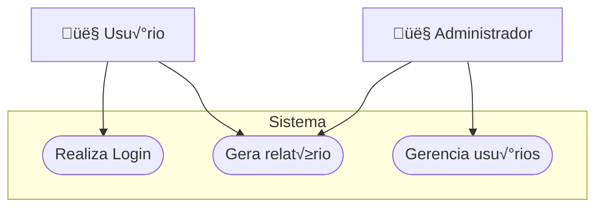
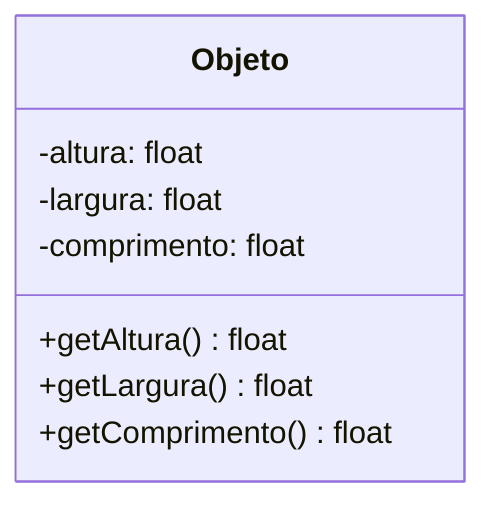
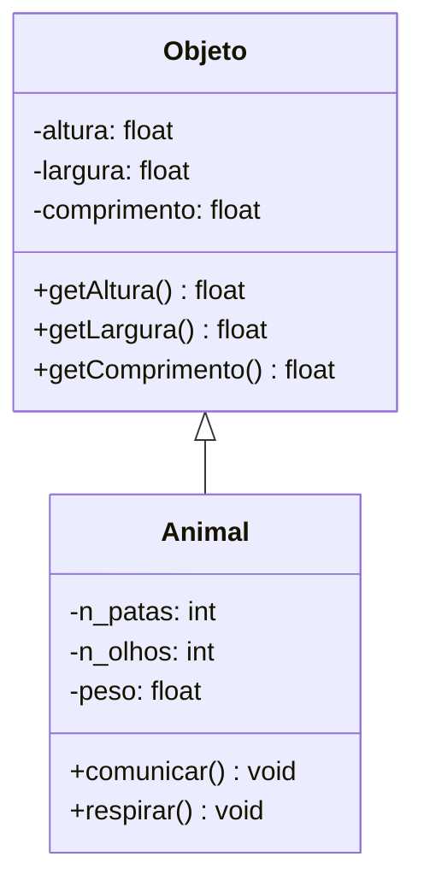
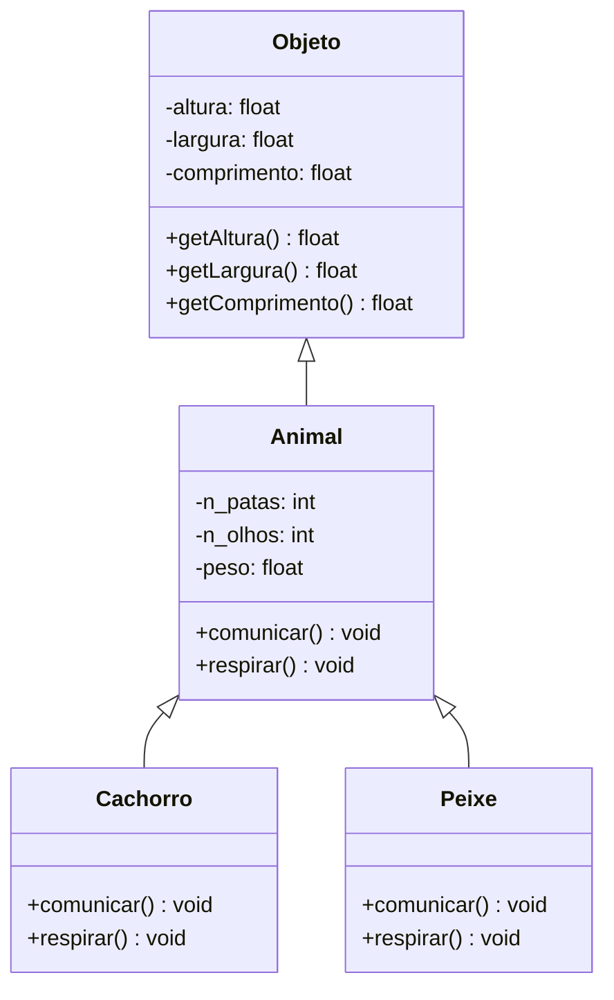
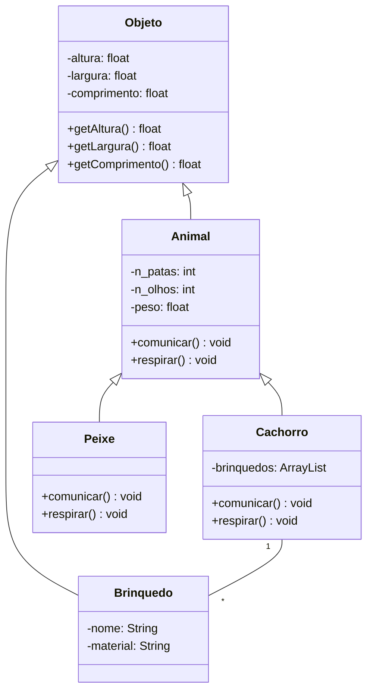

# Unified Modeling Language

A UML (Unified Modeling Language) é uma linguagem de modelagem padronizada utilizada para especificar, visualizar,
construir e documentar sistemas de software, especialmente os orientados a objetos. Ela surgiu na década de 1990, quando
diferentes notações de modelagem começaram a ser unificadas com o objetivo de criar uma linguagem comum, compreensível
por desenvolvedores, analistas e gestores de projetos.

A UML não é uma metodologia de desenvolvimento, mas sim uma linguagem de modelagem que pode ser aplicada em diferentes
abordagens, como o desenvolvimento ágil ou tradicional. Sua função é facilitar a comunicação entre os membros da equipe,
diminuir ambiguidades e servir de guia tanto para a análise quanto para a implementação de sistemas.

Um dos principais pontos fortes da UML é oferecer diferentes tipos de diagramas, cada um voltado a um aspecto do
sistema. Os diagramas podem ser divididos em duas categorias principais:

* Diagramas estruturais, que descrevem a parte est√°tica do sistema, como classes, objetos, componentes e a arquitetura
  geral. O [diagrama de classes](#diagrama-de-classes) é um dos mais utilizados, pois mostra as classes, seus atributos, 
  métodos e relações.
* Diagramas comportamentais, que representam a din√¢mica e o fluxo de atividades no sistema. Exemplos incluem o [diagrama
  de casos de uso](#diagrama-de-casos-de-uso), que mostra como os atores interagem com o sistema, e o diagrama de 
  sequência, que detalha a troca de mensagens entre objetos ao longo do tempo.

Existem diferentes ferramentas de modelagem UML. Nesta disciplina, usaremos a ferramenta online 
[Mermaid](https://mermaid.live):

* Os diagramas são programados com uma linguagem de marcação (mermaid) e são renderizados automaticamente;
* O código dos diagramas pode ser incorporado à documentação do GitHub.

## Tipos de Diagramas

### Diagrama de Caso de Uso

Na linguagem UML, o diagrama de caso de uso descreve como os usu√°rios (atores) interagem com o sistema. 
Ele é útil para capturar os requisitos funcionais do sistema, mostrando as funcionalidades que o sistema deve oferecer e
como os usu√°rios ir√£o utiliz√°-las.

Um diagrama de caso de uso é composto por atores (que são desenhados como bonequinhos palito), e elipses que descrevem 
as atividades desempenhadas pelos atores quando interagem com o sistema:


(adaptado da [Wikipedia](https://en.wikipedia.org/wiki/Use_case_diagram))

O sistema pode ser representado como um retângulo, dentro do qual as elipses estão contidas. Na linguagem de marcação 
Mermaid, não existe uma maneira de representar bonequinhos palito, pois ainda não existe representação para esta 
entidade na linguagem. Todavia, é possível representar os atores como emojis:


```mermaid
flowchart TD
    actor1["👤 Usuário"]
    actor2["👤 Administrador"]

    subgraph Sistema
        uc1([Realiza Login])
        uc2([Gera relatório])
        uc3([Gerencia usu√°rios])
    end

    actor1 --> uc1
    actor1 --> uc2
    actor2 --> uc3
    actor2 --> uc2

```

### Diagrama de Classes

Segundo a [Wikipedia](https://en.wikipedia.org/wiki/Class_diagram):

> Na engenharia de software, um diagrama de classes na Linguagem de Modelagem Unificada (UML) é um tipo de diagrama de 
> estrutura estática que descreve a estrutura de um sistema mostrando as classes do sistema, seus atributos, operações 
> (ou métodos) e os relacionamentos entre os objetos.

> [!NOTE]
> Esse capítulo assume que você está um pouco familiarizado com o paradigma de orientação a objetos.

Os diagramas de classe permitem representar, de maneira visual, a estrutura das classes de um software e seu 
relacionamento com outras entidades.

Na linguagem mermaid, uma classe consiste em um retângulo com 3 subdivisões:

* A parte de cima d√° o nome da classe;
* A parte do meio lista os atributos (características);
* A parte de baixo lista os métodos (comportamentos).

```
classDiagram    
    class Objeto {
        +altura: float
        +largura: float
        +comprimento: float
    }
```


```mermaid
classDiagram    
    class Objeto {
        -altura: float
        -largura: float
        -comprimento: float
        +getAltura() float
        +getLargura() float
        +getComprimento() float
    }
```

O símbolo `+` indica que o atributo ou método tem acesso público (ou seja, pode ser acessado de fora do código-fonte 
da classe), enquanto o símbolo `-` denota atributos ou métodos privados (acesso apenas a partir de código-fonte interno 
à classe). No exemplo acima, `altura`, `largura` e `comprimento` são privados, enquanto os métodos `getAltura`, 
`getLargura` e `getComprimento` s√£o p√∫blicos.

> [!NOTE]
> Os tipos de acesso da UML s√£o:
> * `+`: P√∫blico
> * `-`: Privado
> * `#`: Protegido: acessível a partir de subclasses (classes que herdam a classe-base) e classes no mesmo pacote da 
>   classe-base
> * `~`: Pacote/interno: Acessível apenas a partir de classes no mesmo pacote (indisponível para classes herdeiras)

Para denotarmos uma herança no UML, traçamos uma seta entre as classes:

```
class Animal {
    -n_patas: int
    -n_olhos: int
    -peso: float
    +comunicar() void
    +respirar() void
}

Objeto <|-- Animal
```


```mermaid
classDiagram    
    class Objeto {
        -altura: float
        -largura: float
        -comprimento: float
        +getAltura() float
        +getLargura() float
        +getComprimento() float
    }
        
    class Animal {
        -n_patas: int
        -n_olhos: int
        -peso: float
        +comunicar() void
        +respirar() void
    }

    Objeto <|-- Animal
```

No exemplo acima, a classe `Animal` __herda__ as características e comportamentos da classe `Objeto`. Ou seja, `Animal` 
possui, além de `n_patas`, `n_olhos` e `peso` as características `altura`, `largura` e `comprimento`, bem como os 
métodos _getters_ associados à eles. Além disso, a classe `Animal` adiciona novas características e comportamentos, como 
`comunicar()` e `respirar()`.

Vamos seguir no exemplo de especializar cada vez mais uma classe. Vamos criar as classes `Cachorro` e `Peixe`, que 
herdam a classe `Animal`:

```
class Cachorro {
    +comunicar() void 
    +respirar() void 
}

class Peixe {
    +comunicar() void
    +respirar() void
}

Animal <|-- Cachorro
Animal <|-- Peixe
```


```mermaid
classDiagram    
    class Objeto {
        -altura: float
        -largura: float
        -comprimento: float
        +getAltura() float
        +getLargura() float
        +getComprimento() float
    }
        
    class Animal {
        -n_patas: int
        -n_olhos: int
        -peso: float
        +comunicar() void
        +respirar() void
    }

    Objeto <|-- Animal

    class Cachorro {
        +comunicar() void
        +respirar() void
    }

    class Peixe {
        +comunicar() void
        +respirar() void
    }

    Animal <|-- Cachorro
    Animal <|-- Peixe
```

Perceba como os métodos `comunicar` e `respirar` foram sobrescritos nas subclasses `Cachorro` e `Peixe`, já que estão
descritos novamente. Ou seja, o comportamento original, definido pela superclasse `Animal`, está sendo substituído por 
um novo comportamento nas subclasses.

Vamos supor agora que a classe `Cachorro` tenha um novo atributo `brinquedos`, que é um `ArrayList` de objetos do tipo 
`Brinquedo`. `Brinquedo` não é uma subclasse de `Cachorro`, mas sim uma classe **associada** à `Cachorro`. Nos diagramas
UML, representamos isso com uma seta simples entre as duas classes, onde a classe de onde parte a seta possui 
conhecimento da classe sendo apontada pela seta. Em outras palavras, uma classe faz uso dos métodos e atributos da 
outra, mas o inverso não é verdadeiro:

```
class Cachorro {
    -brinquedos: ArrayList<Brinquedo>

    +comunicar() void
    +respirar() void
}

class Brinquedo {
    -nome: String
    -material: String 
}

Objeto <|-- Brinquedo

Cachorro "1" -- "*" Brinquedo : possui >
```


```mermaid
classDiagram    
    class Objeto {
        -altura: float
        -largura: float
        -comprimento: float
        +getAltura() float
        +getLargura() float
        +getComprimento() float
    }
        
    class Animal {
        -n_patas: int
        -n_olhos: int
        -peso: float
        +comunicar() void
        +respirar() void
    }

    Objeto <|-- Animal

    class Cachorro {
        -brinquedos: ArrayList<Brinquedo>
        
        +comunicar() void
        +respirar() void
    }

    class Peixe {
        +comunicar() void
        +respirar() void
    }

    Animal <|-- Cachorro
    Animal <|-- Peixe
    
    class Brinquedo {
        -nome: String
        -material: String 
    }
    
    Objeto <|-- Brinquedo
    
    Cachorro "1" -- "*" Brinquedo 
```

> [!NOTE]
> A relação entre as classes pode ser **bidirecional**. Ou seja, as duas classes possuem conhecimento uma da outra. 
> Nesse caso, ao invés de uma seta simples, usaríamos apenas uma aresta: `Cachorro "1" -- "*" Brinquedo`.

> [!NOTE]
> Os números na associação entre as classes denotam a cardinalidade:
> * `Cachorro "1" -- "*" Brinquedo` significa que um cachorro possui entre 0 e N brinquedos;
> * `Cachorro "1" -- "1..*" Brinquedo` significa que um cachorro possui entre 1 e N brinquedos;
> * `Cachorro "*" -- "*" Brinquedo` significa um cachorro possui entre 0 e N brinquedos, e um brinquedo pode pertencer 
>   a entre 0 e N cachorros. 

#### Exercícios

1. Implemente em Java o diagrama de classe abaixo: 
   
   ```mermaid
    classDiagram
    class ContaBancaria {
        -cc: int
        -ag: int
        -titular: String
        -saldo: float
   
        +depositar(valor: float) void  
        +sacar(valor: float) float  
        +consultarSaldo() float  
    }
   ```

2. Implemente em Java o diagrama de classe abaixo:

   ```mermaid
    classDiagram
        class Funcionario {
        #nome: String 
        #salario: float
        +exibirDados() void
    }
    
    class Gerente {
        #departamento: String 
   
        +exibirDados() void 
    }
    
    Funcionario <|-- Gerente
   ```

3. Desenhe o diagrama de classes correspondente no [mermaid.live](https://mermaid.live):

   ```java
    public class Produto {
        private int codigo;
        private String nome;
        private double preco;
    
        public Produto(int codigo, String nome, double preco) {
            this.codigo = codigo;
            this.nome = nome;
            this.preco = preco;
        }
        
        public double getPreco() {
            return preco;
        }
        
        public void exibirDados() {
            System.out.println(codigo + " - " + nome + " : R$ " + preco);
        }
    }
   ```

4. Desenhe o diagrama de classes correspondente no [mermaid.live](https://mermaid.live):
   
   ```java
    import java.util.ArrayList;
    import java.util.List;
    
    public class Biblioteca {
        private String nome;
        private List<Livro> livros = new ArrayList<>();
    
        public Biblioteca(String nome) {
            this.nome = nome;
        }
    
        public void adicionarLivro(Livro livro) {
            livros.add(livro);
        }
    }
    
    class Livro {
        private String titulo;
        private String autor;
        private int ano;
    }
   ```
 
5. Para o texto abaixo, implemente primeiro o diagrama UML de classes, e depois o código-fonte correspondente:
   > Modele um sistema simples para representar universidades e estudantes.
   > * Universidade possui nome e uma lista de Estudante.
   > * Estudante possui nome e matrícula.
   > * A universidade deve ter um método adicionarEstudante(Estudante e). 

6. Para o texto abaixo, implemente primeiro o diagrama UML de classes, e depois o código-fonte correspondente:
   > Modele um sistema simples de vendas:
   > * Loja possui nome e uma lista de Pedido.
   > * Pedido possui numero, valorTotal e est√° associado a um √∫nico Cliente.
   > * Cliente possui nome e cpf.
   > * A loja deve ter um método registrarPedido(Pedido p).
   
### Diagrama de Casos de Uso


## Recursos adicionais

* [Mermaid (ferramenta de design)](https://mermaid.live)
* [Mermaid (Documentação)](https://docs.mermaidchart.com/mermaid-oss/syntax/flowchart.html)
